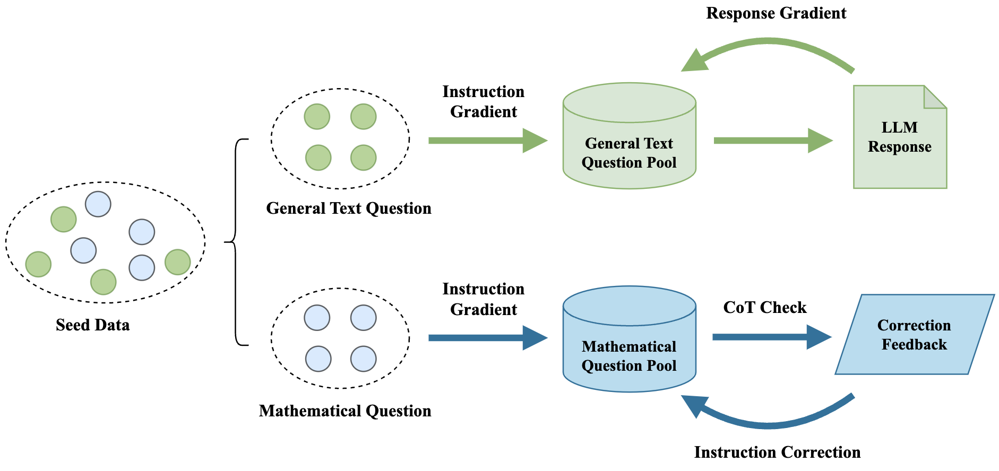

# IDGen: Item Discrimination Induced Prompt Generation for LLM Evaluation

## Intruduction

Item Discrimination (ID) theory, which is widely used in educational assessment, measures the ability of individual test items to differentiate between high and low performers. Our data synthesis framework prioritizes both breadth and specificity. It can generate prompts that comprehensively evaluate the capabilities of LLMs while revealing meaningful performance differences between models, allowing for effective discrimination of their relative strengths and weaknesses across various tasks and domains.

## Background

Research and applications in the field of Natural Language Processing (NLP) have made significant progress, with large language models (LLMs) performing exceptionally well across various tasks, and data serving as the foundation for model performance. Model evaluation plays a crucial role in the development of LLMs, as it guides the iterative improvements during training, enables the selection of the best model variations, and facilitates their deployment in real-world applications. However, obtaining such datasets often requires substantial human and time investment, and issues like poor data quality are frequently encountered. Therefore, it is necessary to explore automated methods for generating evaluation datasets.

## Pipeline

The pipeline is illustrated in the following figure: 

Firstly, we handcraft a batch of seed data, dividing it into math category and general text category. Next, we generate a batch of dataset through "instruction gradient". For instructions in the general text category, we generate responses using a LLM, then generate new instructions through "response gradient", i.e., propose new questions based on the response. For problems in the math category, we check them through CoT check, and apply self-correct according to the CoT check’s feedback.

## Citation

If you use the related theories or methods from our work or utilize our data, feel free to cite us.
